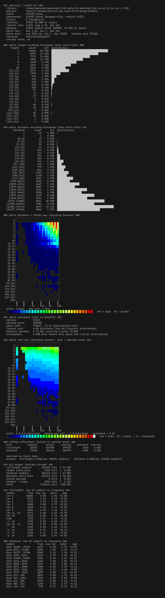
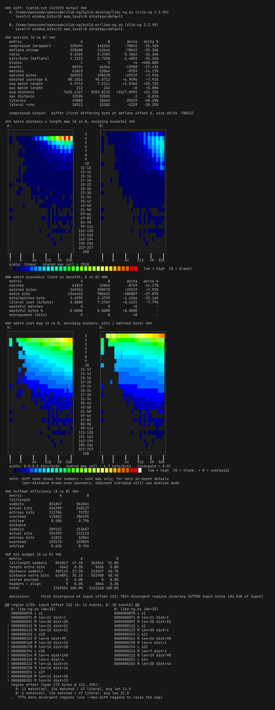
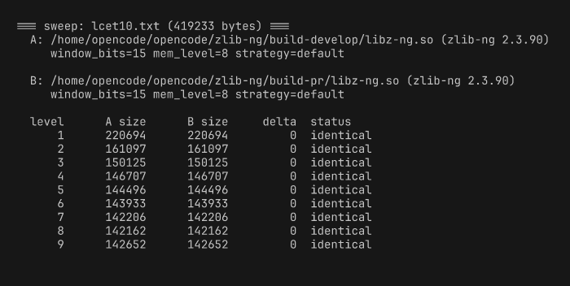

# zanalyze

Peek inside the deflate stream of any `.gz`, `.zip`, `.png`, `.jar`, or `.apk` file.

`zanalyze.py` can also compress a file with a zlib/zlib-ng library you supply, then
parse the resulting stream down to the bit level: every match the compressor chose,
the Huffman codes it emitted, how much those matches actually cost, and — in
`diff` mode — exactly where two builds (or two option sets) diverge.

Single-file python script. No third-party dependencies.

## Features

- **Full deflate parser** — decode every stored/dynamic/fixed block, every
  match (length + distance) and literal run, straight from `z_stream`
  `next_in`/`total_out`, and cross-check by re-inflating with system zlib.
- **Report of record** — per-file summary (sizes, ratios, blocks), an optional
  per-event match/literal listing, match-length and match-distance
  histograms, a 2-D **match distance x length map**, a **match economics**
  report (cost vs benefit, per-distance break-even boundaries, and a
  bits/matched-byte **cost map**), Huffman efficiency (actual vs entropy
  bits), and a per-symbol stream bit budget.
- **`analyze-file`** — analyze an _existing_ stream instead of compressing
  one: `.gz` / `.zlib` / `.def` files, a `.png`'s IDAT data (plus the image
  header and per-scanline filter stats), or a `.zip`/`.jar`/`.apk`'s deflate
  entries, aggregated into a single analysis.
- **`diff` two builds** — compress the same data with two libraries (or one
  library with different `--level` / `--window-bits` / `--strategy` …) and get
  a neutral A/B metrics table, side-by-side match and cost maps, and a
  per-region listing of every place their decision streams diverge.
  `--sweep` condenses that into a compact per-level table.
- **Machine-readable output** — `--json` anywhere; `--json-full` lifts the
  cap on the big per-symbol data.

## Requirements

- Python **3.10+** (standard library only; CI runs on 3.12).
- A zlib or zlib-ng **shared library** (`libz.so` / `libz-ng.so`) to drive
  compression. `analyze-file` mode uses system zlib to recover the source.
- The libraries are loaded with `RTLD_LOCAL | RTLD_DEEPBIND`, so several
  builds can coexist in one process — handy for `diff`.

## Quick start

```bash
# one library, full report (lcet10.txt is in zlib-ng's test data)
python3 zanalyze.py analyze --lib build-develop/libz-ng.so lcet10.txt

# per-event listing + literal bytes
python3 zanalyze.py analyze --lib build-develop/libz-ng.so lcet10.txt --events --show-bytes

# analyze an existing compressed file, a PNG, or a ZIP/JAR/APK
python3 zanalyze.py analyze-file data.gz
python3 zanalyze.py analyze-file image.png
python3 zanalyze.py analyze-file archive.zip

# diff two libraries (comma form)
python3 zanalyze.py diff --lib build-develop/libz-ng.so,build-pr/libz-ng.so lcet10.txt

# per-side options: A at level 1, B at level 9
python3 zanalyze.py diff --lib build-develop/libz-ng.so,build-pr/libz-ng.so lcet10.txt --level 1,9

# compact per-level report, then machine-parseable JSON
python3 zanalyze.py diff --lib build-develop/libz-ng.so,build-pr/libz-ng.so lcet10.txt --sweep
python3 zanalyze.py analyze --lib build-develop/libz-ng.so lcet10.txt --json
```

## Screenshots

The match-length/distance analysis and the match-cost report are the heart of
the tool, so they deserve the color treatment (256-color cells, forced on with
`--map-colors-on`). Generated with
[`freeze`](https://github.com/charmbracelet/freeze).

### `analyze` — match map + match economics + cost map

`python3 zanalyze.py analyze --lib build-develop/libz-ng.so lcet10.txt --map-colors-on`
(truncated to the map/cost sections).



The match map is honest about density: each cell shades by count on a linear
scale. The cost map below it always uses a fixed **0.0–8.0 bits/matched-byte**
scale, so shading is comparable across files and runs — cells that cost more
than 8 bits per matched byte (i.e. more than the 8 literal bits they replaced)
render as a bright white `X`.

### `diff` — side-by-side maps on a shared scale

`python3 zanalyze.py diff --lib build-develop/libz-ng.so,build-pr/libz-ng.so lcet10.txt --level 1,9 --map-colors-on`



Two builds compressed at different levels, shown side by side. Both maps share
a common scale so differences jump out at a glance; the neutral A/B table
keeps counts, matched bytes, and wasteful-match percentages for each side
without editorializing about which is "better".

### `diff --sweep` — compact per-level comparison

`python3 zanalyze.py diff --lib build-develop/libz-ng.so,build-pr/libz-ng.so lcet10.txt --sweep`



Each row is one compression level (1–9). Identical decision streams (same
sizes, and often the same for the two zlib-ng branches here) report as
`identical`; when the two sides diverge on a level, the `status` column names
the first decision-diff input offset and the first differing stream byte, and
the trailer values (adler/crc/isize) are marked same vs `DIFF` beneath.

## Reading the report

Every section is printed under a `=== heading ===` (sweep and the maps keep
their own layouts), and output stays 2-space indented. In document order:

| Section | What it shows |
| --- | --- |
| **analysis summary** | Source size, deflate size, ratio, stored/dynamic/fixed block counts, first-block type, and the adler/crc trailer (read as stored, never recomputed). |
| **match length / distance histograms** | Bucketed by deflate length code / distance code by default (each sans its extra bits); `--length-full` / `--dist-log2` switch to per-length and log2 buckets. |
| **match distance x length map** | A 2-D grid, length rows × distance columns, shaded by density. Defaults to the 29×30 deflate encoding buckets with an honest/linear scale; `--map-axis-linear` uses uniform linear bins, `--map-scale-log2` switches shading to log2. |
| **match economics** | How many matches were worth it: matches/matched bytes/bit cost vs the all-literal alternative, the per-distance **break-even boundary** (the longest match length that still overpays), the most-overpaid cell, and the 2-D **cost map** (fixed 0.0–8.0 bits/matched-byte; cells over 8.0 are waste and render as `X`). |
| **huffman efficiency** | Actual bits vs Shannon entropy bits per tree (lit/length and distance), a match/literal bit split, and the savings from using static vs dynamic trees. |
| **bit budget** | Where the stream's bits went: lit/len codes, len extra bits, dist codes, dist extra bits, stored, header. |
| **symbol tables** | Top-15 most frequent lit/length and distance symbols (disable with `--no-huff-symbols`). |

The per-event listing (`--events`) shows the raw decision stream: `L count`
for a literal run, `M length dist` for a match — the same events `diff` aligns
to find divergences.

## Options at a glance

- `--level / --window-bits / --mem-level / --strategy` — compression options;
  in `diff` mode each accepts `A,B` to differ per side.
- `--events --show-bytes` — per-event match/literal listing with literal bytes.
- `--length-full --dist-log2 --map-axis-linear --map-scale-log2` — histogram
  and map granularity.
- `--map-colors-on / --map-colors-off` — force map cell colorization on or off
  (otherwise auto-detected from the terminal).
- `--sweep --levels 1,3,5-9` — compact per-level diff report.
- `--json [--json-full]` — machine-readable output, uncapped.
- `--no-progress` — disable the stderr decode progress bar.

## Tests and linting

```bash
python3 test_zanalyze.py                 # uses build-develop/libz-ng.so by default
python3 test_zanalyze.py PATH_TO_LIBZNG  # or a specific library

ruff check zanalyze.py test_zanalyze.py  # clean
mypy zanalyze.py test_zanalyze.py        # clean
pylint zanalyze.py test_zanalyze.py      # 10/10
```

## License

The zlib license — see [LICENSE.md](LICENSE.md).
Copyright (C) 2026 Hans Kristian Rosbach.
